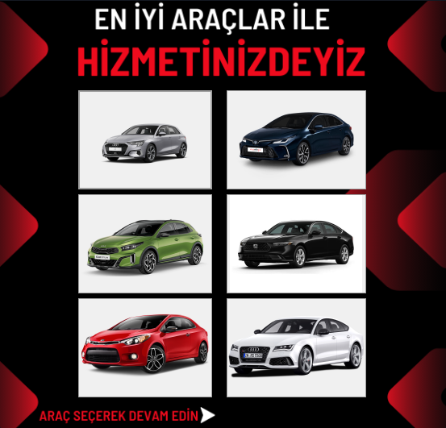
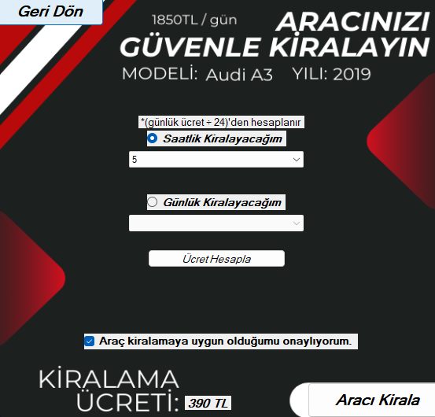

# 🚗 Araç Kiralama Sistemi

Bu proje, **C# Windows Forms** kullanılarak geliştirilmiş bir **Araç Kiralama Otomasyonu** uygulamasıdır. Kullanıcılar, sistem üzerinden araçları listeleyebilir, kiralama işlemleri başlatabilir, bitirebilir ve araç ekleme/silme/güncelleme gibi işlemleri yapabilir. Proje eğitim amaçlıdır.

## 🧩 Özellikler

- Admin girişi ile kullanıcı doğrulama
- Araç ekleme, silme ve güncelleme
- Araçların uygunluk durumunu kontrol etme
- Araç kiralama işlemini başlatma ve tamamlama
- Müşteri bilgilerini kaydetme
- Kiralama tarih bilgisi takibi
- Basit ve kullanıcı dostu arayüz

## 🛠️ Kullanılan Teknolojiler

- C# (Windows Forms)
- .NET Framework
- Visual Studio
- (Opsiyonel: JSON, XML ya da SQL Server ile veri saklama)

## 🖼️ Uygulama İçi Ekran Görüntüleri

- **Giriş Ekranı**  

- **Araç Listesi**  

- **Araç Detay**  

- **Kiralama Seçenekleri**  

- **Ödeme**  

